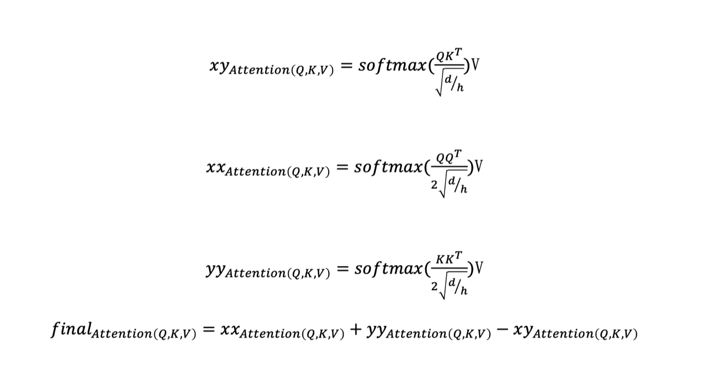

# Cross-Attention Based BERT4Rec

Cross Attention 




## Usage

**Requirements**

* python 3.6+
* Tensorflow 1.15 (GPU version)
* CUDA compatible with TF 1.15

**Run**

For simplicity, here we take ml-1m as an example:

``` bash
./run_ml-1m.sh
```
include two part command:
generated masked training data
``` bash
python -u gen_data_fin.py \
    --dataset_name=${dataset_name} \
    --max_seq_length=${max_seq_length} \
    --max_predictions_per_seq=${max_predictions_per_seq} \
    --mask_prob=${mask_prob} \
    --dupe_factor=${dupe_factor} \
    --masked_lm_prob=${masked_lm_prob} \
    --prop_sliding_window=${prop_sliding_window} \
    --signature=${signature} \
    --pool_size=${pool_size} \
```

train the model
``` bash
CUDA_VISIBLE_DEVICES=0 python -u run.py \
    --train_input_file=./data/${dataset_name}${signature}.train.tfrecord \
    --test_input_file=./data/${dataset_name}${signature}.test.tfrecord \
    --vocab_filename=./data/${dataset_name}${signature}.vocab \
    --user_history_filename=./data/${dataset_name}${signature}.his \
    --checkpointDir=${CKPT_DIR}/${dataset_name} \
    --signature=${signature}-${dim} \
    --do_train=True \
    --do_eval=True \
    --bert_config_file=./bert_train/bert_config_${dataset_name}_${dim}.json \
    --batch_size=${batch_size} \
    --max_seq_length=${max_seq_length} \
    --max_predictions_per_seq=${max_predictions_per_seq} \
    --num_train_steps=${num_train_steps} \
    --num_warmup_steps=100 \
    --learning_rate=1e-4
```

### hyper-parameter settings
json in `bert_train` like `bert_config_ml-1m_64.json`

```json
{
  "attention_probs_dropout_prob": 0.2,
  "hidden_act": "gelu",
  "hidden_dropout_prob": 0.2,
  "hidden_size": 64,
  "initializer_range": 0.02,
  "intermediate_size": 256,
  "max_position_embeddings": 200,
  "num_attention_heads": 2,
  "num_hidden_layers": 2,
  "type_vocab_size": 2,
  "vocab_size": 3420
}
```


